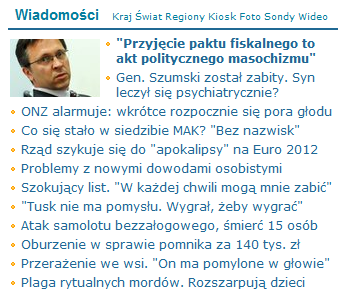

Na portalu onet.pl jest [wywiad](http://wiadomosci.onet.pl/tylko-w-onecie/rybinski-przyjecie-paktu-fiskalnego-to-akt-polityc,1,5012900,wiadomosc.html) ze mną, przeprowadzony wczoraj wieczorem. W tym wywiadzie prostym językiem wyjaśniam pozornie trudne sprawy związane z Unią Europejską i polską gospodarką.

  

